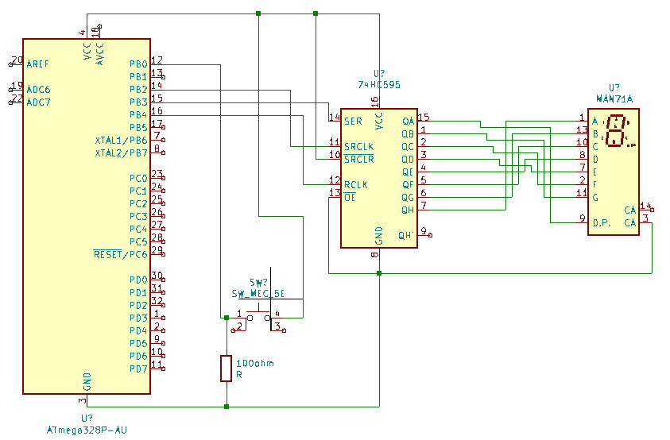

# TEJ4M Computer Interfacing Lab
Source and CAD for the TEJ4M computer interfacing lab.

The goal of this project is to develop a dual-processor system, linked over USB/UART, where the host has cryptographic random number generation capabilities and the coprocessor has a small 7-segment display. The idea is that any time a specific button is pressed, a new truly random number will be displayed.

## Source layout

The source code is split into three modules:

 - `common`
   - Common code between the host and coprocessor
 - `desktop`
   - The host code
 - `coprocessor`
   - The coprocessor code

## Building

Configure the toolchain:

```sh
rustup toolchain install nightly-2020-11-20
rustup component add rust-src rls-preview rust-analysis --toolchain nightly-2020-11-20
sudo apt-get install binutils gcc-avr avr-libc avrdude
```

Build the desktop side of the project:

```sh
./scripts/build-desktop.sh
```

Build the avr side of the project:

```sh
./scripts/build-coprocessor.sh
```

## Schematic



## The multi-processor communication protocol

Communication between the two devices is done via a simple "question-answer" system, described below, and implemented in [`common/src/protocol/mod.rs`](https://github.com/Ewpratten/tej4m_computer_interfacing_lab/blob/master/common/src/protocol/mod.rs).

### Request

| Data    | Size | Description                 |
| ------- | ---- | --------------------------- |
| `0x01`  | `u8` | Packet type (request)       |
| size    | `u8` | Packet size after this byte |
| request | `u8` | Type of data requested      |

### Response

| Data    | Size | Description                 |
| ------- | ---- | --------------------------- |
| `0x02`  | `u8` | Packet type (response)      |
| size    | `u8` | Packet size after this byte |
| payload | `u8` | Response payload            |